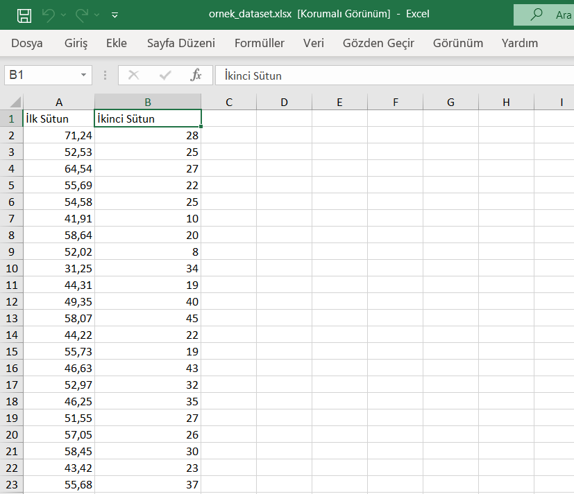
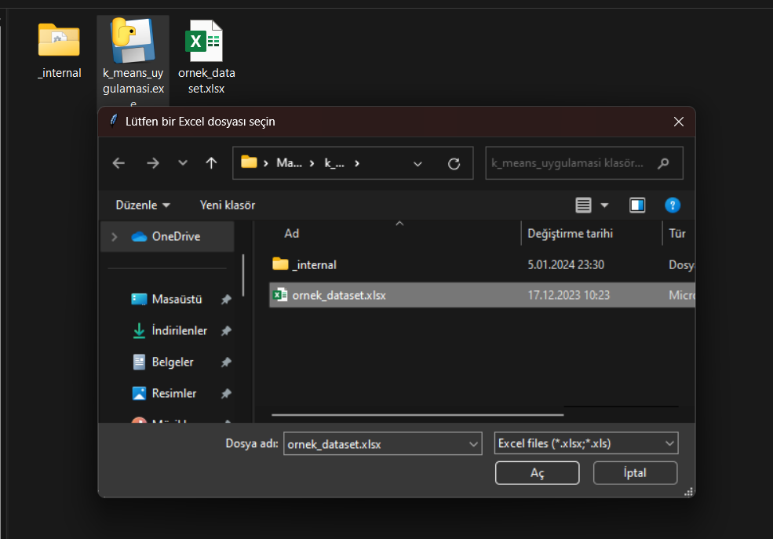
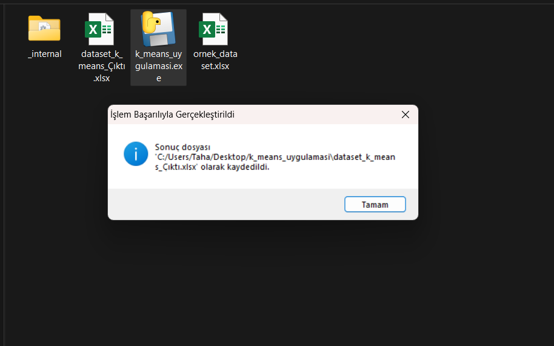
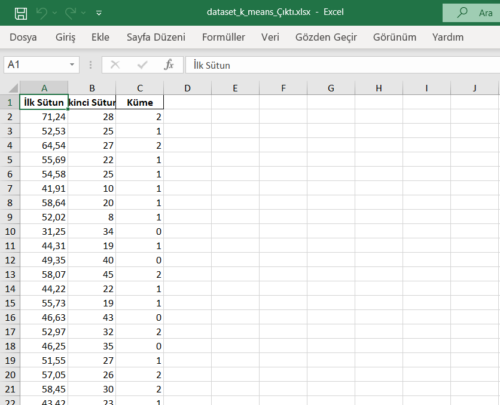

# Açıklama
Hazır kod kullanmadan bir k_means algoritması oluşturdum. Algoritma özet olarak kullanıcıdan iki sütundan oluşan ve içerisinide sayısal değerler olan bir excel dosyasını alıp kümeliyor.

Algoritmanın kodunu ve pyinstaller modülü ile hazırlamış olduğum uygulamayı paylaşıyorum. Eğer uygulamadan çalıştırırsanız python yüklü olmasa bile hiçbir bağımlılık sorunu yaşamazsınız.

Eğer kodu çalıştırmak isterseniz bağımlılıkları yüklemelisiniz.

# Kurulum

```bash
    pip install pandas
```

```bash
    pip install openpyxl
```


Ya da direkt olarak requirements.txt üzerinden indirebilirsiniz.

```bash
    pip install -r requirements.txt
```

# Kod
Kodum dört fonksiyondan oluşuyor, önce fonksiyonları açıklayacağım.

## dosya_sec() fonksiyonu:

Bu fonksiyonda tkinter kütüphanesinden faydalanarak kullanıcıya excel dosyasını seçtiriyorum ve dosya yolunu döndürüyorum.

```python
def dosya_sec():
    dosya_yolu = filedialog.askopenfilename(title="Lütfen bir Excel dosyası seçin", filetypes=[("Excel files", "*.xlsx;*.xls")])
    if not dosya_yolu:
        messagebox.showwarning("Uyarı", "Dosya seçmediniz! Program sonlandırılıyor.")
        print("Dosya seçilmedi. Program sonlandırılıyor.")
        sys.exit()
    return dosya_yolu
```

## k_sayisi_penceresi() ve k_sayisi_al fonksiyonları:

Burada kullanıcı açılan pencereye k sayısını giriyor ve "Onayla" butonuna basıyor. Yani k sayısını kullanıcıya seçtiriyorum. 

```python
def k_sayisi_penceresi():
    pencere = Tk()
    pencere.title("K Sayısı Belirleme")
    pencere.geometry("300x150")

    label = Label(pencere, text="Lütfen k sayısını giriniz:")
    label.pack(pady=10)

    k_giris = Entry(pencere)
    k_giris.pack(pady=10)

    def k_sayisi_al():
        try:
            global k
            k = int(k_giris.get())
            pencere.destroy()
        except ValueError:
            messagebox.showerror("Hata", "Geçersiz giriş. Lütfen bir sayı girin.")

    button = Button(pencere, text="Onayla", command=k_sayisi_al)
    button.pack(pady=10)

    pencere.protocol("WM_DELETE_WINDOW", sys.exit)

    pencere.mainloop()
```

## k_means(dataset) fonksiyonu:

Asıl işin yapıldığı fonksiyon burada. Bu fonksiyon genel hatlarıyla dört aşamadan oluşuyor. 


İlk aşamada her merkezin datasetimdeki verilere uzaklıkları bir sözlüğe alınıyor, en son sırasıyla tek bir sözlükte toplanıyor
```python
def k_means(dataset):
    while (True):
       
        for i in range(k):
            uzaklik_dict_temp = {}
            for j in range(
                    len(dataset)):
                birinci_sutun_fark = dataset.iloc[j, 0] - merkezler.iloc[i, 0]
                ikinci_sutun_fark = dataset.iloc[j, 1] - merkezler.iloc[i, 1]
                uzaklik = math.sqrt(pow(birinci_sutun_fark, 2) + pow(ikinci_sutun_fark, 2))
                uzaklik_dict_temp.update({j: uzaklik})
            uzaklik_dict.update({i: uzaklik_dict_temp})
```
İkinci aşamada uzaklık sözlüğündeki mesafeler karşılaştırılır ve en kısa mesafesi olan merkez, ilgili noktanın kümesi olarak seçilir.

```python
        kume_no = []
        for j in range(len(dataset)):
            min_mesafe = []
            for i in range(k):
                min_mesafe.append(uzaklik_dict[i][j])
            mim_deger = min(min_mesafe)
            kume_no.append(min_mesafe.index(mim_deger))
        dataset['Küme'] = kume_no
```

Üçüncü aşamada yeni merkezler hesaplanır.

```python
        yeni_birinci_kolon = []
        yeni_ikinci_kolon = []
        for i in range(k):
            birinco_kolon = []
            ikinci_kolon = []
            for j in range(len(dataset)):
                if dataset.iloc[j, 2] == i:
                    birinco_kolon.append(dataset.iloc[j, 0]) 
                    ikinci_kolon.append(dataset.iloc[j, 1])

            if len(birinco_kolon) != 0:
                yeni_birinci_kolon.append(sum(birinco_kolon) / len(birinco_kolon))
            else:
                yeni_birinci_kolon.append(0)
            if len(birinco_kolon) != 0:
                yeni_ikinci_kolon.append(sum(ikinci_kolon) / len(ikinci_kolon))
            else:
                yeni_ikinci_kolon.append(0)
```

Dördüncü ve son aşamadaysa yeni merkezler eski merkezlerle aynı mı diye kontrol edilir, aynıysa döngüden çıkılır ve işlem biter. Ayı değilse döngü devam eder ta ki aynı olana kadar.

```python
        eski_birinci_kolon = merkezler.iloc[:, 0].tolist()
        eski_ikinci_kolon = merkezler.iloc[:, 1].tolist()

        if yeni_birinci_kolon == eski_birinci_kolon and yeni_ikinci_kolon == eski_ikinci_kolon:
            break
        else:
            merkezler.iloc[:, 0] = yeni_birinci_kolon
            merkezler.iloc[:, 1] = yeni_ikinci_kolon
            continue
```

Kodun fonksiyon kısmı buraya kadardı. Yukarıdaki k_means() fonksiyonunun parçaları while döngüsünün içinde, girintilere dikkat edin.

## Excel dosyasının dataframe olarak kaydedilmesi:
Burada excel dosyası, pandas kütüphanesinin dataframe veri yapısı formatında kaydediyoruz. Bunun sebebi, pandas kütüphanesini kullanarak veri üzerinde rahatça işlem yapmak.
```python
dosya_yolu = dosya_sec()
dataset = pd.read_excel(dosya_yolu)
```

## Kullanıcıdan k sayısını alma:
Burada kulnıcıdan k sayısını alıyoruz ve başlangıç için k adet merkez belirliyoruz.
```python
k_sayisi_penceresi()
merkezler = dataset.sample(k).reset_index(drop=True)
```

## Kümeleme işleminin yapılması ve çıktının kaydedilmesi:
Burada "dataset" değişkenini k_means() fonksiyonuna koyuyorum ve kümeleme işlemi yapılıyor. 
```python
k_means(dataset)
```
Ve son olarak çıktıyı almış olduğumuz excel dosyasının dizinine 'dataset_k_means_Çıktı.xlsx' adıyla kaydediyoruz.
```python
output_file_path = os.path.join(os.path.dirname(dosya_yolu), 'dataset_k_means_Çıktı.xlsx')
dataset.to_excel(output_file_path, index=False)
```

# Kodun uygulama haline getirilmesi
Bunun için pyinstaller modülünü kullandım. Kullanmak için önce kurmamız gerek.
```bash
    pip install pyinstaller
```
Kurduktan sonra python dosyamızın olduğu dizinden konola şu komutları yazıyoruz, tabi ben bunu örnek olarak yazıyorum, buradaki path leri kendinize göre doldurmalısınız. Aksi takdirde çalışmaz.
```bash
pyinstaller --noconfirm --onedir --windowed 
--add-data "C:/Users/"kullanıcı"/AppData/Local/Programs/Python/Python310/Lib/site-packages/pandas;pandas/" 
--add-data "C:/Users/"kullanıcı"/AppData/Local/Programs/Python/Python310/Lib/site-packages/openpyxl;openpyxl/"  
"C:/Users/"kullanıcı"/"python dosyamın dizini"/k_means_uygulamasi.py"
```

# Uygulamanın çalıştırılması
Vermiş olduğum rar dosyasını indirin ve içindeki klasörü çıkarın.

Elinizde paylaşmış olduğum excel dosyası indirin veya aynı formatta, içerisinde iki sütun olan ve sayısal değerler içeren bir excel dosyası edinin.

Bütün bu şartları sağladıysanız siz de bu şekilde uygulamayı kullanabilirsiniz:

### 1. "ornek_dataset.xlsx" bu şekilde


### 2. Uygulamamı çalıştırıyorum ve gellen pencereden excel dosyamı  seçiyorum. 


### 3. Seçtikten sonra gelen pencereye k sayısını giriyorum.


### 4. İşlem başarılı bir şekilde gerçekleşiyor ve "dataset_k_means_Çıktı.xlsx" dosyası oluşuyor.


### 5. Son olarak da "dataset_k_means_Çıktı.xlsx" dosyasını içeriği de bu şekilde.


# Not
Datasetinizdeki sütun adlarının ne olduğu önemsizdir, program için bir anlam ifade etmiyor.


